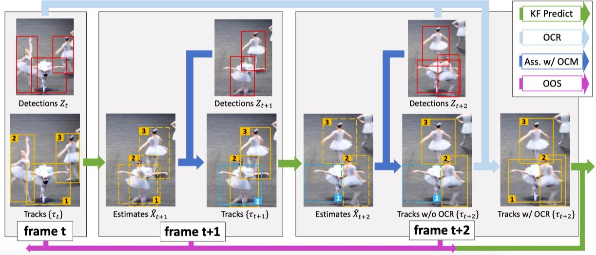
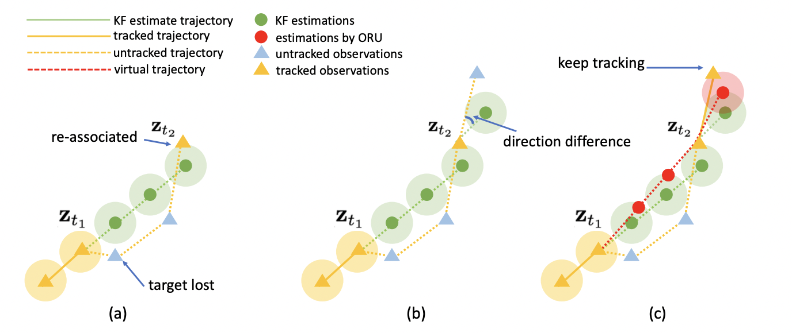

# OC-SORT

[](https://arxiv.org/abs/2203.14360) [](https://opensource.org/licenses/MIT) 

**Observation-Centric SORT (OC-SORT)** is a pure motion-model-based multi-object tracker. It aims to improve tracking robustness in **crowded scenes and when objects are in non-linear motion**. It is designed by recognizing and fixing limitations in Kalman filter and [SORT](https://arxiv.org/abs/1602.00763). It is flexible to integrate with different detectors and matching modules, such as appearance similarity. It remains, **Simple, Online and Real-time**.

### Pipeline
<center>

</center>


### Observation-centric Re-Update 
<center>

</center>

## News
* [07/09/2023]: A C++ support is provided. See the [doc](deploy/OCSort/cpp/Readme.md) for instructions. Thanks for the contribution!
* [07/01/2023]: [Deep OC-SORT](https://github.com/GerardMaggiolino/Deep-OC-SORT/) is accepted to ICIP2023. It adds an adaptive appeareance similarity-based association upon OC-SORT.
* [03/15/2023]: We update the preprint version on [Arxiv](https://arxiv.org/pdf/2203.14360.pdf). We rename OOS to be "Observation-centric Re-Update" (ORU).
* [02/28/2023]: OC-SORT is accepted to CVPR 2023. We will update the code and paper soon. We made intensive revision of the paper writing.
* [02/26/2023]: Deep-OC-SORT, a combination of OC-SORT and deep visual appearance, is released on [Github](https://github.com/GerardMaggiolino/Deep-OC-SORT/) and [Arxiv](https://arxiv.org/abs/2302.11813). Significant performance improvement on MOT17, MOT20 and DanceTrack.
* [08/16/2022]: Support OC-SORT in [mmtracking](https://github.com/open-mmlab/mmtracking). If you want to do tracking with more advanced and customizable experience, you may want to give it a try. The mmtracking version is still in-preview. Performance on more datasets to be verified.
* [04/27/2022]: Support intergration with BYTE and multiple cost metrics, such as GIoU, CIoU, etc.
* [04/02/2022]: A preview version is released after a primary cleanup and refactor. 
* [03/27/2022]: The [arxiv preprint](https://arxiv.org/abs/2203.14360) of OC-SORT is released.

## Benchmark Performance

[](https://paperswithcode.com/sota/multi-object-tracking-on-dancetrack?p=observation-centric-sort-rethinking-sort-for) 
[](https://paperswithcode.com/sota/multiple-object-tracking-on-kitti-tracking?p=observation-centric-sort-rethinking-sort-for)
[](https://paperswithcode.com/sota/multi-object-tracking-on-mot17?p=observation-centric-sort-rethinking-sort-for) 
[](https://paperswithcode.com/sota/multi-object-tracking-on-mot20-1?p=observation-centric-sort-rethinking-sort-for) 
[](https://paperswithcode.com/sota/multiple-object-tracking-on-crohd?p=observation-centric-sort-rethinking-sort-for)


| Dataset          | HOTA | AssA | IDF1 | MOTA | FP      | FN      | IDs   | Frag   |
| ---------------- | ---- | ---- | ---- | ---- | ------- | ------- | ----- | ------ |
| MOT17 (private)  | 63.2 | 63.2 | 77.5 | 78.0 | 15,129  | 107,055 | 1,950 | 2,040  |
| MOT17 (public)   | 52.4 | 57.6 | 65.1 | 58.2 | 4,379   | 230,449 | 784   | 2,006  |
| MOT20 (private)  | 62.4 | 62.5 | 76.4 | 75.9 | 20,218  | 103,791 | 938   | 1,004  |
| MOT20 (public)   | 54.3 | 59.5 | 67.0 | 59.9 | 4,434   | 202,502 | 554   | 2,345  |
| KITTI-cars       | 76.5 | 76.4 | -    | 90.3 | 2,685   | 407     | 250   | 280    |
| KITTI-pedestrian | 54.7 | 59.1 | -    | 65.1 | 6,422   | 1,443   | 204   | 609    |
| DanceTrack-test  | 55.1 | 38.0 | 54.2 | 89.4 | 114,107 | 139,083 | 1,992 | 3,838  |
| CroHD HeadTrack  | 44.1 | -    | 62.9 | 67.9 | 102,050 | 164,090 | 4,243 | 10,122 |

* Results are from reusing detections of previous methods and shared hyper-parameters. Tune the implementation adaptive to datasets may get higher performance.
* The inference speed is ~28FPS by a RTX 2080Ti GPU. If the detections are provided, the inference speed of OC-SORT association is 700FPS by a i9-3.0GHz CPU.
* A sample from DanceTrack-test set is as below and more visualizatiosn are available on [Google Drive](https://drive.google.com/drive/folders/1-T4jhHwhOAp42DGJ115yMlC7CkB-PNxy?usp=sharing)

    


## Get Started
* See [INSTALL.md](./docs/INSTALL.md) for instructions of installing required components.

* See [GET_STARTED.md](./docs/GET_STARTED.md) for how to get started with OC-SORT.

* See [MODEL_ZOO.md](./docs/MODEL_ZOO.md) for available YOLOX weights.

* See [DEPLOY.md](./docs/DEPLOY.md) for deployment support over ONNX, TensorRT and ncnn.


## Demo
To run the tracker on a provided demo video from [Youtube](https://www.youtube.com/watch?v=qv6gl4h0dvg):

```shell
python3 tools/demo_track.py --demo_type video -f exps/example/mot/yolox_dancetrack_test.py -c pretrained/ocsort_dance_model.pth.tar --path videos/dance_demo.mp4 --fp16 --fuse --save_result --out_path demo_out.mp4
```

<center>

</center>


## Roadmap
We are still actively updating OC-SORT. We always welcome contributions to make it better for the community. We have some high-priorty to-dos as below:
- [x] Add more asssocitaion cost choices: GIoU, CIoU, etc.
- [x] Support OC-SORT in [mmtracking](https://github.com/open-mmlab/mmtracking).
- [ ] Add more deployment options and improve the inference speed.
- [x] Make OC-SORT adaptive to customized detector (in the [mmtracking](https://github.com/open-mmlab/mmtracking) version).


## Acknowledgement and Citation
The codebase is built highly upon [YOLOX](https://github.com/Megvii-BaseDetection/YOLOX), [filterpy](https://github.com/rlabbe/filterpy), and [ByteTrack](https://github.com/ifzhang/ByteTrack). We thank their wondeful works. OC-SORT, filterpy and ByteTrack are available under MIT License. And [YOLOX](https://github.com/Megvii-BaseDetection/YOLOX) uses Apache License 2.0 License.

If you find this work useful, please consider to cite our paper:
```
@inproceedings{cao2023observation,
  title={Observation-centric sort: Rethinking sort for robust multi-object tracking},
  author={Cao, Jinkun and Pang, Jiangmiao and Weng, Xinshuo and Khirodkar, Rawal and Kitani, Kris},
  booktitle={Proceedings of the IEEE/CVF Conference on Computer Vision and Pattern Recognition},
  pages={9686--9696},
  year={2023}
}
```
